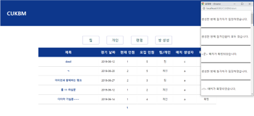

## CUKBM(Catholic University of Korea Big Match)
### 함께 스포츠를 즐길 사람을 매칭해주는 서비스
2019년 1학기 객체지향 패러다임 팀프로젝트   
교내에서 스포츠, e-스포츠를 같이 즐길 사람이 필요 할때, 게임방처럼 게시판에 방을 만들어 참가자들을 모집하여 여러 경기를 즐길 수 있게 하는 웹
### Screenshot
 - 메인화면   
   
 - 게시판   

### 구현 목록
- 로그인 - 회원가입, 정보 수정, 개인 알람
- 스포츠(각 종목) : 게시판 - 글생성, 글 상세 정보 보기, 참가 결정
- e-스포츠(각 종목) : 게시판 - 글생성, 글 상세 정보 보기, 참가 결정
- 랜덤 참가 기능

### 사용 스택
 - Front-end : jsp, html, css
 - Back-end : java servlet
 - etc : Tomcat9, mysql, JSTL
 
 ### 팀원
권현준(tkstka0023) : Backend 담당 
김여정(who1129) : Frontend 담당
문영환(sky3085) : Frontend 담당
윤종명(whdauddbs) : Backend 담당
정현진(HyeonjinJeong) : 디자인, UI/UX 담당

#jsp, #mysql, #웹 개발, #MVC_패턴_구현
